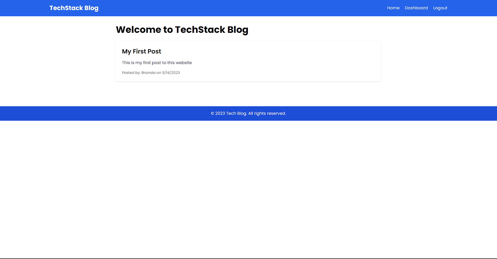

# TechStack Blog

[](https://opensource.org/licenses/MIT)
[](https://www.npmjs.com/package/bcrypt)
[](https://www.npmjs.com/package/connect-session-sequelize)
[](https://www.npmjs.com/package/dotenv)
[](https://www.npmjs.com/package/express)
[](https://www.npmjs.com/package/express-handlebars)
[](https://www.npmjs.com/package/express-session)
[](https://www.npmjs.com/package/method-override)
[](https://www.npmjs.com/package/mysql2)
[](https://www.npmjs.com/package/sequelize)
[](https://www.npmjs.com/package/tailwindcss)

## Description

TechStack Blog is a web application designed to empower users to create, share, and engage with technology-related content. It offers a user-friendly interface where registered users can write and publish blog posts, comment on existing posts, and connect with a community of tech enthusiasts. With robust features like user authentication, real-time commenting, and an intuitive dashboard, Tech Blog provides a seamless platform for tech-savvy individuals to express their ideas, stay updated on industry trends, and foster meaningful discussions. Built using modern web technologies like Node.js, Express.js, and Sequelize, Tech Blog offers a reliable and scalable environment for tech bloggers and readers alike.

## Table of Contents

- [Getting Started](#getting-started)
- [Usage](#usage)
- [Contributing](#contributing)
- [License](#license)
- [Credits](#credits)
- [Acknowledgements](#acknowledgements)
- [Questions](#questions)

## Getting Started

To get started, simply open the website in your browser.

```
https://techstack-blog-app-b8f4e2fcb679.herokuapp.com/
```

## Usage

**Creating an Account:**

1. Navigate to the Tech Blog website.
2. Click on "Sign Up" to create a new account.
3. Provide a unique username and a strong password.
4. Click "Sign Up" to create your account.

**Logging In:**

1. If you already have an account, click on "Login."
2. Enter your username and password.
3. Click "Login" to access your account.

**Writing a Blog Post:**

1. After logging in, click on "Dashboard."
2. In the dashboard, click "Create New Post."
3. Fill in the post title and content.
4. Click "Save Post" to publish it.

**Viewing Blog Posts:**

1. On the homepage, you can see a list of all blog posts.
2. Click on a post title to read the full post.
3. You can also see the post's creation date, author, and comments.

**Commenting on Posts:**

1. Scroll to the end of a blog post.
2. In the comments section, type your comment.
3. Click "Submit Comment" to add your comment.

**Editing/Deleting Posts (Authors Only):**

1. Go to your dashboard.
2. Click on the post you want to edit/delete.
3. Use the "Edit Post" or "Delete Post" buttons.

**Logging Out:**

1. Click on your username at the top right.
2. Select "Logout" to log out securely.

**Engaging with the Community:**

1. Interact with other users by commenting on their posts.
2. Explore posts on various tech topics.
3. Enjoy discussions, knowledge-sharing, and networking in the tech community.

Enjoy using Tech Blog for creating, sharing, and discussing technology-related content!



## Contributing

Please contact me for contributions

## License

This project is licensed under the MIT license.

```
Copyright <2023> <Brandon Zhang>

Permission is hereby granted, free of charge, to any person obtaining a copy of this software and associated documentation files (the “Software”), to deal in the Software without restriction, including without limitation the rights to use, copy, modify, merge, publish, distribute, sublicense, and/or sell copies of the Software, and to permit persons to whom the Software is furnished to do so, subject to the following conditions:

The above copyright notice and this permission notice shall be included in all copies or substantial portions of the Software.

THE SOFTWARE IS PROVIDED “AS IS”, WITHOUT WARRANTY OF ANY KIND, EXPRESS OR IMPLIED, INCLUDING BUT NOT LIMITED TO THE WARRANTIES OF MERCHANTABILITY, FITNESS FOR A PARTICULAR PURPOSE AND NONINFRINGEMENT. IN NO EVENT SHALL THE AUTHORS OR COPYRIGHT HOLDERS BE LIABLE FOR ANY CLAIM, DAMAGES OR OTHER LIABILITY, WHETHER IN AN ACTION OF CONTRACT, TORT OR OTHERWISE, ARISING FROM, OUT OF OR IN CONNECTION WITH THE SOFTWARE OR THE USE OR OTHER DEALINGS IN THE SOFTWARE.
```

## Credits

Brandon Zhang

## Acknowledgements

This project was made possible thanks to several tools, libraries, and services:

- **Express**: An efficient, minimalist web framework for Node.js that facilitated the creation of our API endpoints. [View on npm](https://www.npmjs.com/package/express)

- **Sequelize**: A powerful ORM for Node.js, which simplified database interactions and management. [View on npm](https://www.npmjs.com/package/sequelize)

- **bcrypt**: A library for hashing passwords, enhancing the security of user data. [View on npm](https://www.npmjs.com/package/bcrypt)

- **Connect-Session-Sequelize**: A session store for Express.js that worked seamlessly with Sequelize, enhancing user authentication and session management. [View on npm](https://www.npmjs.com/package/connect-session-sequelize)

- **dotenv**: A utility for loading environment variables from a .env file, ensuring secure configuration management. [View on npm](https://www.npmjs.com/package/dotenv)

- **Method-Override**: Middleware for handling HTTP methods like PUT and DELETE, enabling better RESTful API design. [View on npm](https://www.npmjs.com/package/method-override)

- **MySQL2**: A Node.js-based MySQL library for database connectivity and management. [View on npm](https://www.npmjs.com/package/mysql2)

- **Tailwind CSS**: A versatile CSS framework that streamlined frontend development with a focus on utility classes. [Official website](https://tailwindcss.com/)

- **Heroku**: The platform used for deployment, making this application accessible to users worldwide.

These tools, libraries, and services played crucial roles in the development, security, and accessibility of our Tech Blog web application. We're grateful for the open-source community that contributes to these resources, enabling us to build and share this project.

## Questions

If you have any questions, please feel free to contact me via email or on GitHub.

Email: branola1998628@gmail.com

GitHub: [verouge](https://github.com/verouge)
